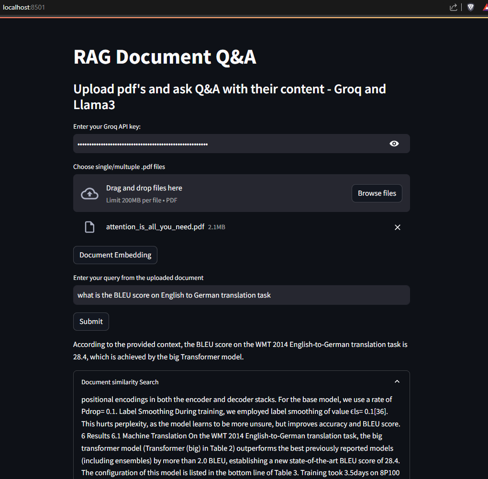

# RAG Document Question & Answer App

## Description
This Streamlit app is designed to provide users with answers to their questions based on uploaded pdf/url using RAG (Retrieval Augmented Generation) approach.

## Screenshots


## Set-up
1. To get started, first create an API_KEY from here: https://console.groq.com/keys. Then update the `GROQ_API_KEY` in the app text input with newly generated API_KEY. 

2. To get started, first install the dependencies using:
    ```commandline
     pip install -r requirements.txt
    ```
   
3. Run the streamlit app:
   ```commandline
   streamlit run main.py
   ```

**Contact**
For any questions or issues, please contact Prateek @ [s.prateek3080@gmail.com].
   
**Additional Terms:**
This software is licensed under the MIT License. However, commercial use of this software is strictly prohibited without prior written permission from the author. Attribution must be given in all copies or substantial portions of the software.